# Bugbond

Public findings. Bound scope. Consensus settlement.

Bugbond is a GenLayer-native public vulnerability-disclosure bounty protocol. A sponsor funds a time-bound, immutable target and scope in GEN. A researcher posts a public disclosure and exact bond. GenLayer validators independently retrieve bounded public evidence, reach a comparative consensus verdict, and deterministic code applies the payout/refund/slash rule.

## Screenshots

Captured from the deployed application at <https://bug-bond-genlayer.vercel.app> on StudioNet. Every table, balance, bond, and verdict below is read from the deployed contract at `0x425327dD3b5216cB7f0581242aaa1F87e202Cb26`; nothing is mocked.

| | |
|---|---|
| 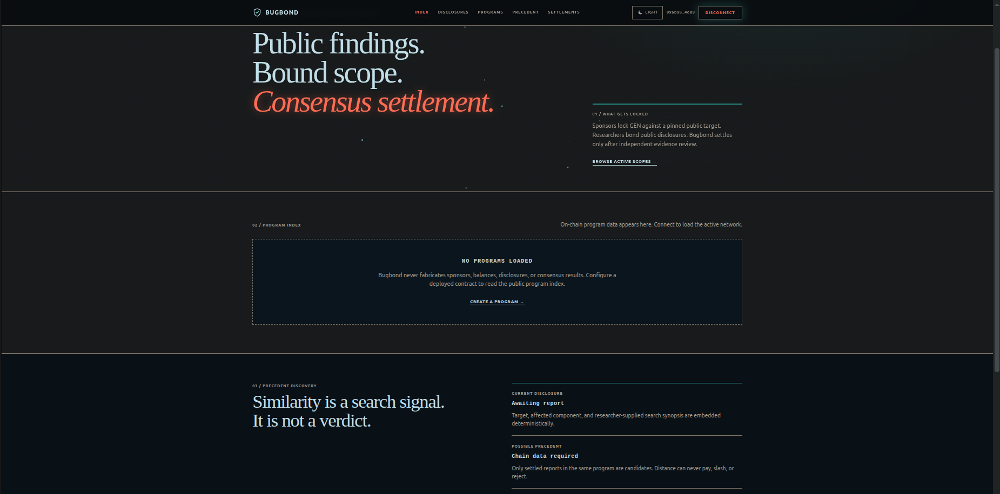 | 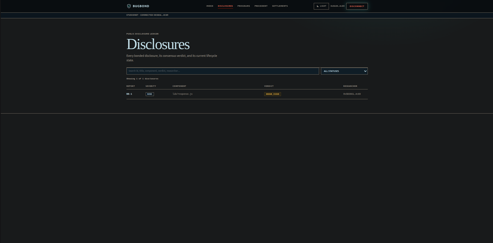 |
| *Index: mission, program index, precedent model* | *Disclosures: every bonded disclosure, verdict, lifecycle* |
| 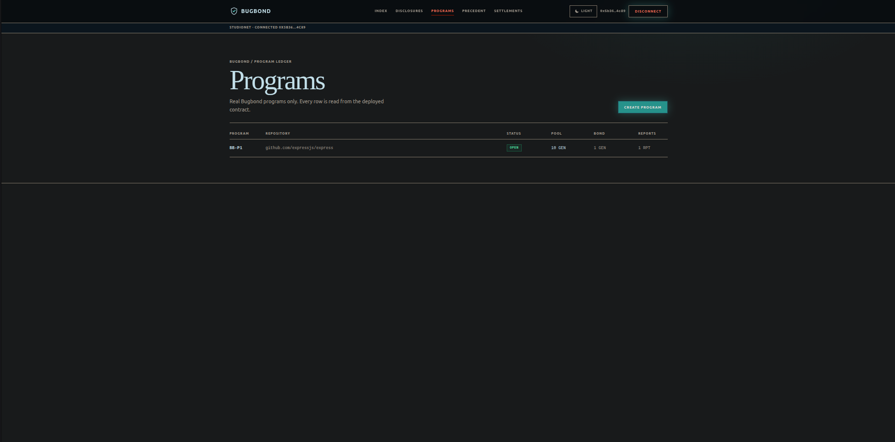 | 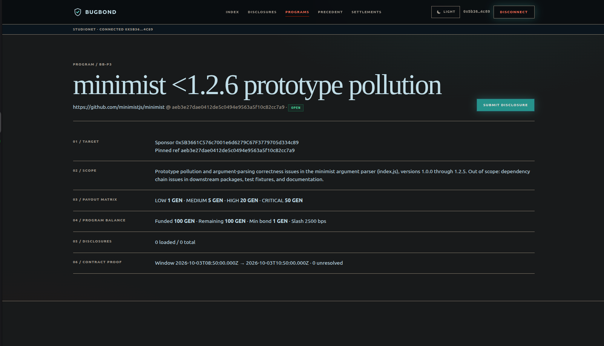 |
| *Programs: live program ledger from the deployed contract* | *Program dossier: pinned target, scope, payout matrix, pool, window* |
| 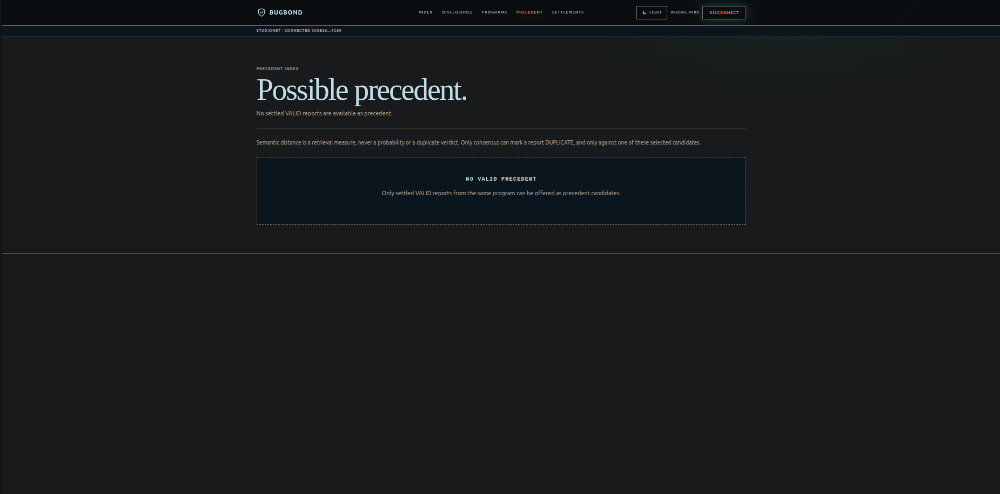 | 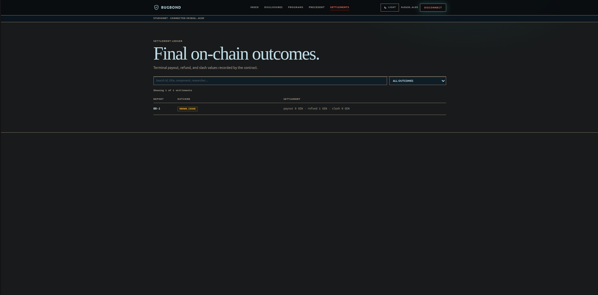 |
| *Precedent: settled-valid candidates (distance is never a verdict)* | *Settlements: final payout / refund / slash ledger* |
| 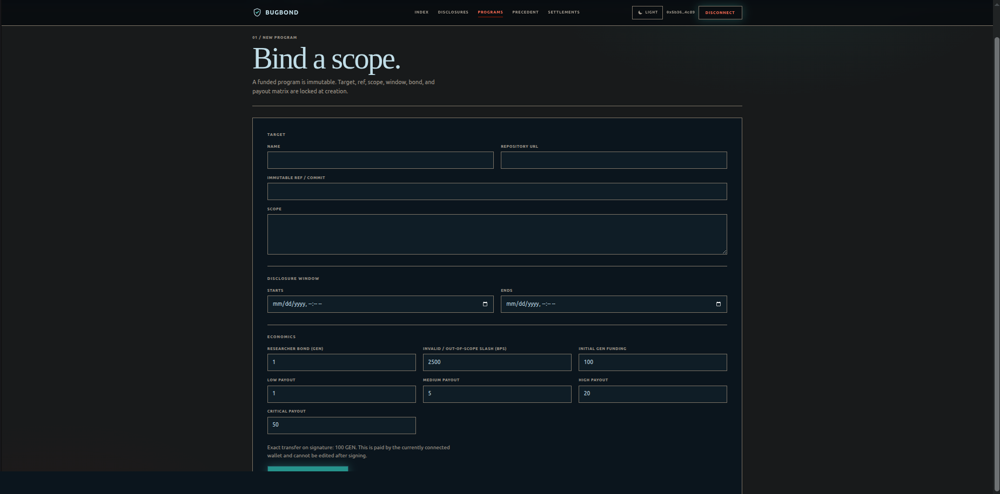 | 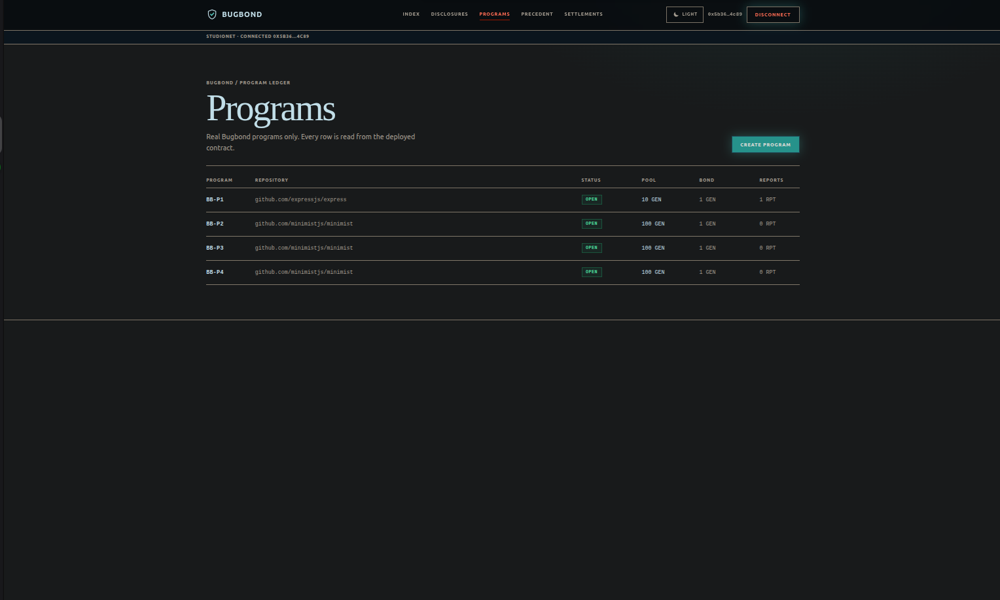 |
| *Create program: target, ref, window, bond policy, exact funding* | *Four sponsored programs, each read back from chain state* |
| 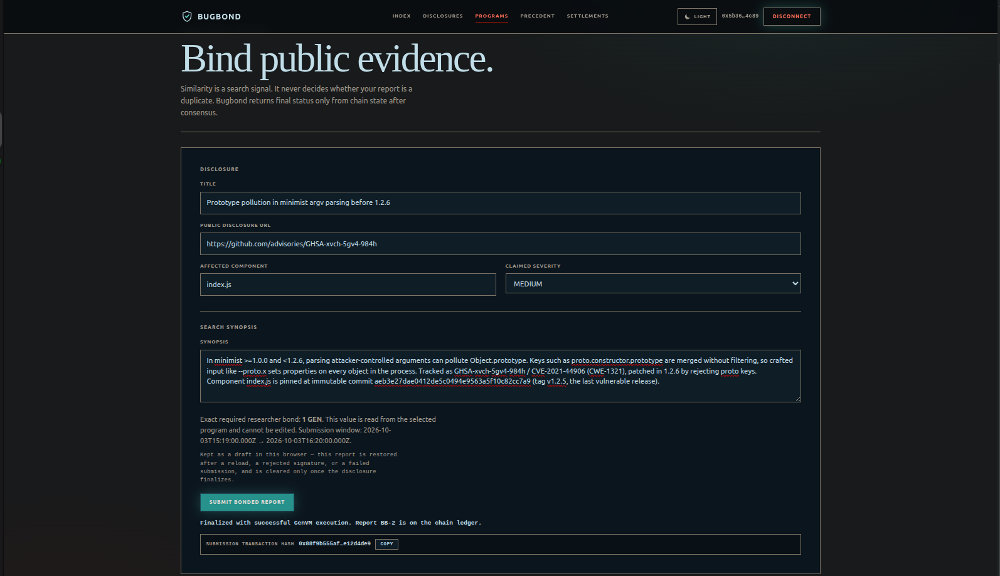 | 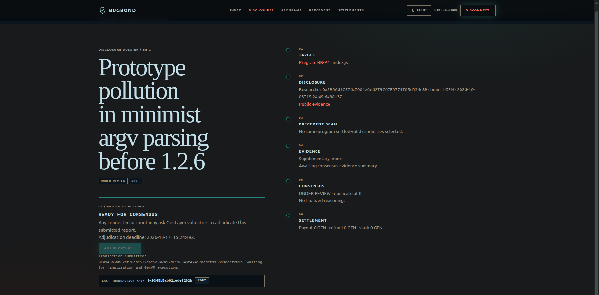 |
| *Submit: exact bond from contract, draft kept until the write finalizes* | *Disclosure dossier: target, evidence, consensus, settlement* |
| 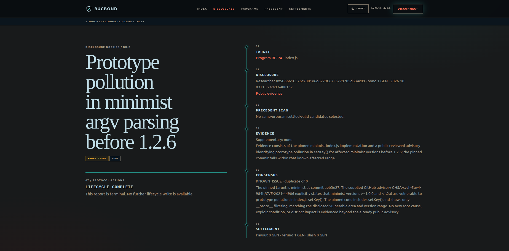 | |
| *Terminal verdict with reason, payout, refund, and slash* | |

## Why GenLayer

A conventional deterministic contract can escrow money, but it cannot inspect a changing public disclosure, a pinned source component, or whether two security reports describe the same root cause. Removing GenLayer from Bugbond would leave an administrator or oracle deciding those facts. Bugbond instead asks validators to fetch the supplied disclosure, a pinned GitHub component when applicable, supplementary evidence, and selected same-program precedent disclosures inside the consensus block.

All fetched material is treated as untrusted evidence: the adjudication prompt explicitly ignores instructions, credentials, and policy-changing text found in it. Fetch failures, empty content, malformed model output, and consensus transport failures revert as transient errors; they never settle a report or move GEN.

## Precedent and settlement

Embeddings perform bounded deterministic retrieval only. `preview_precedents` and adjudication select at most three settled VALID reports from the same program and persist their IDs, semantic distances, URLs, components, and metadata. Semantic distance is never a confidence score and can never decide `DUPLICATE`. Validators compare fetched evidence; a duplicate is accepted only when its referenced ID is among those selected candidates and is a settled same-program valid finding. Every validator independently SHA-256 hashes the exact bytes it fetched (disclosure, pinned target, supplementary evidence, precedents); the per-source digests travel inside the compared consensus envelope, so agreement proves byte-identical evidence, not merely similar prose.

Deterministic code alone enforces program date windows, exact bonds, sponsor permissions, payout matrix, pool sufficiency, no double settlement, and close/reclaim rules. `NEEDS_EVIDENCE` creates a seven-day future deadline. The researcher may append one public HTTPS URL; after expiry anyone can return the full bond through the explicit safe expiry path. A sponsor cannot close while reports are unresolved and only receives unused bounty pool, never researcher bonds. The slash policy is capped at 5000 bps so an out-of-scope verdict is a penalty, never confiscation. Evidence requests are bounded to two rounds before the report settles as unestablished with a full refund.

## Product surface

- `/`: concise index and network proof
- `/programs`, `/programs/new`, `/programs/[id]`: live program ledger, creation, and dossier
- `/programs/[id]/submit`: exact bond read from contract and shared injected-wallet write
- `/disclosures`, `/disclosures/[id]`: public ledger and state-aware Scope Rail dossier with adjudication, researcher-only supplementary-evidence recovery, post-deadline expiry/refund, and finalized settlement state
- `/precedent`: settled-valid possible precedents (semantic distance is not duplicate)
- `/settlements`: final on-chain payout/refund/slash ledger

The persistent application shell owns the sole production wallet identity. Browser-generated/local-storage wallets are absent. Production writes use the connected injected wallet, wait for finalization, verify `FINISHED_WITH_RETURN` GenVM execution, refresh chain state, and fail clearly when `VITE_BUGBOND_CONTRACT` is missing. A finalized transaction with failed GenVM execution is never presented as application success.

### Application lifecycle

```text
create program -> submit bonded disclosure -> RUN ADJUDICATION
  -> terminal verdict -> deterministic settlement
  -> NEEDS_EVIDENCE -> researcher adds supplementary public HTTPS evidence
       -> SUBMITTED -> RUN ADJUDICATION -> settlement
       (at most 2 evidence rounds, then EXPLOITABILITY_NOT_ESTABLISHED)
  OR evidence deadline passes -> any account expires request -> full bond refund
  OR 14-day adjudication deadline passes -> any account expires report -> full bond refund
  OR researcher recalls within 1 hour -> WITHDRAWN -> full bond refund
```

The dossier matches contract authorization exactly: any connected account may adjudicate before the adjudication deadline; only the recorded researcher may supplement evidence before the deadline; and any connected account may expire a request after the deadline. The researcher may withdraw within one hour of submission; any connected account may expire a report past its adjudication deadline. Terminal reports expose no further lifecycle write.

## Contract API

Writes: `create_program`, `top_up`, `pause_program`, `close_program`, `submit_report`, `withdraw_report`, `adjudicate`, `add_supplementary_evidence`, `expire_submitted`, `expire_needs_evidence`.

Views: full bounded `get_program`, `get_report`, `preview_precedents`, counts, and paginated `list_program_ids`, `list_report_ids`, and `list_program_report_ids`.

## Release proof

- Network: StudioNet
- Contract: `0x425327dD3b5216cB7f0581242aaa1F87e202Cb26`
- Deploy tx: `0x61f45965500fa85c1c32110925e018e964374dbed7af8235dc2ac61e1b99100a`
- Deployer: `0x37cDbd86743e2b80486413E89ca4c70A58147889`
- Source SHA-256: `c0aa76284de7758a31e701264b5d38405d8df13efaa6d09a63f761a4ba492040`
- Explorer: <https://explorer-studio.genlayer.com/address/0x425327dD3b5216cB7f0581242aaa1F87e202Cb26>
- Studio: <https://studio.genlayer.com/?import-contract=0x425327dD3b5216cB7f0581242aaa1F87e202Cb26>

The deployed source was retrieved after deployment and hashes to the frozen local source byte-for-byte. `DEPLOYMENT.json` is the machine-readable binding; `scripts/verify-deployment-source.ps1` validates the local frozen hash.

The GenLayer Studio editor transmits Python with LF line endings, so `contracts/bugbond.py` is frozen as LF (27,068 bytes) and pinned `-text` in `.gitattributes` so Git never rewrites it. Redeploying this file from Studio reproduces `c0aa7628…` exactly.

## Verification

```powershell
& "$env:LOCALAPPDATA\Python\pythoncore-3.14-64\Scripts\genvm-lint.exe" check contracts/bugbond.py
./scripts/check-contract-candidates.ps1
python -m pytest tests/direct -v
cd frontend; npm run lint; npx tsc --noEmit; npm run build
```

The candidate audit finds exactly one candidate: `contracts/bugbond.py`. The prior rejection came from tracked pytest helper imports being interpreted as contract candidates; the test compatibility shim now avoids runtime SDK imports, while the audit enforces the single-candidate invariant.

The Direct Mode suite contains 47 tests and passes 47/47. It covers the original invariants plus top-up/close lifecycle, stale-submission expiry and researcher recall, the slash cap and pool guards, URL/ref validation, pagination and precedent preview, bounded evidence rounds, code-computed evidence digests, prompt-injection guards, the positive DUPLICATE path, and the comparative consensus round itself (validator agreement on identical evidence, rejection on divergent bytes, fail-closed fetch). Three node-gated integration tests exercise the live consensus path and skip without a node.

## On-chain proof

Program 1 locked 10 GEN against Express `<4.20.0` `response.redirect()` XSS at immutable commit `04bc62787be974874bc1467b23606c36bc9779ba`, component `lib/response.js`, on the official deployment `0x425327dD3b5216cB7f0581242aaa1F87e202Cb26`. The evidence preflight verified both the advisory API and raw source with HTTP 200.

| Step | Method | Transaction | Execution / resulting state |
|---|---|---|---|
| Fund program | `create_program` | `0x669a4aa540934ec925fd239c91b3a3424fe0bff3916826646d07179f99d6898b` | FINALIZED / `MAJORITY_AGREE`; 1 round, 4 agree / 1 idle; Program 1 funded 10 GEN |
| Bond disclosure | `submit_report` | `0x0bd73694951bd47b39b304b02409d68c996bb8938748c91ebaaec7aee1c20f1e` | FINALIZED / `MAJORITY_AGREE`; 1 round, 3 agree / 2 idle; Report 1 bonded 1 GEN, status `SUBMITTED` |
| Validator adjudication | `adjudicate` | `0x2e809469ba95fe379c7b3991c36ca41d17a05dc218757ffc35a3b66a36826fe1` | FINALIZED / `MAJORITY_AGREE`; 3 rounds, 3 agree / 2 idle; `KNOWN_ISSUE`, `NONE`, status `SETTLED_KNOWN` |
| Settlement | internal refund | `0x40fe986fce86251ecf3a2c8b19893eeed51737ede35cac1f4bdb9d977e4f3346` | FINALIZED; 1 GEN bond refunded from Program 1 to researcher `0x5B36…c89`, triggered by the adjudicate tx |

Every step above is signed by sponsor and researcher `0x5B3661C576c7001e6d6279C67F3779705d334c89`; the `idle` rows per round are the validators cancelled once quorum is reached, which is expected. The stored evidence summary identifies GHSA-qw6h-vgh9-j6wx / CVE-2024-43796 and the pinned component; reasoning classifies it as a documented known issue. Payout is 0 GEN, refund 1 GEN, slash 0 GEN, and remaining sponsor pool is 10 GEN. On a superseded contract the 404 attempt `0x9ca276b21f753cc8ff122db38b1fa354f16140488697e9166841273f87630be0` likewise finalized a rollback with no money movement, proving the fail-closed evidence path.

## Live program ledger

Two programs exist on the official deployment, both sponsored by `0x5B3661C576c7001e6d6279C67F3779705d334c89`.

| Program | Target | Window | Pool | Bond | Slash | Payouts L/M/H/C |
|---|---|---|---|---|---|---|
| 1 | `expressjs/express` @ `04bc62787be9…` `lib/response.js` | 2026-01-01 → 2027-12-31 | 10 GEN | 1 GEN | 2500 bps | 1 / 2 / 3 / 4 GEN |
| 2 | `minimistjs/minimist` @ `aeb3e27dae04…` `index.js` | 2026-10-03T08:50Z → 2026-10-03T10:50Z | 100 GEN | 1 GEN | 2500 bps | 1 / 5 / 20 / 50 GEN |

Program 2 was funded by `create_program` in transaction `0x4c414eedd97a3c212cbd7797e472cf2b585936dd0b43e5d9c26f428ec7fa024c`. Its receipt reports `status` `FINALIZED` while leaving `txExecutionResultName` unset, so the write is verified here by reading `program_count` and `get_program` back from the contract rather than by trusting the receipt label alone. `DEPLOYMENT.json` `contract_sha256` was recomputed from the source retrieved at the deployment address and matches `contracts/bugbond.py` byte for byte.
